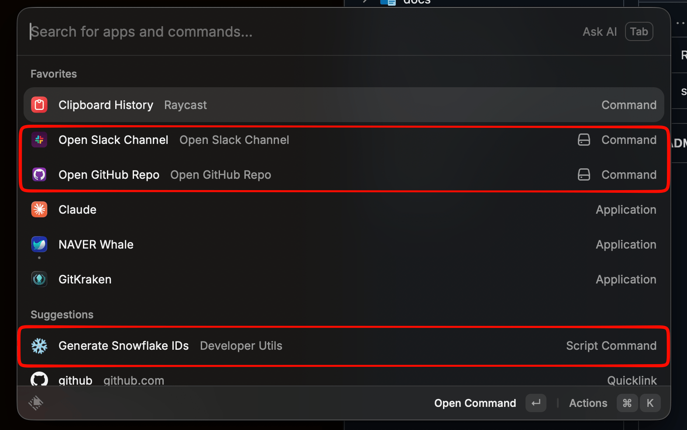

# Raycast Extensions

> [English](./README_EN.md)

일상 생산성을 위한 커스텀 Raycast 확장 모음입니다.



| 확장 | 타입 | 설명 |
|------|------|------|
| [Slack Channel Opener](./slack-channel-opener) | Extension | Slack 채널을 이름으로 검색하고 바로 열기 |
| [GitHub Repo Opener](./github-repo-opener) | Extension | GitHub 레포를 검색하고 Code/PR/Actions 등 바로 열기 |
| [Snowflake ID Generator](./snowflake-id-generator) | Script Command | Snowflake ID 생성 (Crockford Base32) |

## 빠른 시작

### Extensions (Slack / GitHub)

```bash
cd slack-channel-opener  # 또는 github-repo-opener
npm install
npm run dev
```

Raycast가 자동으로 확장을 인식합니다. 첫 실행 시 API 토큰을 입력하세요.

### Script Command (Snowflake)

1. Raycast 설정 > Extensions > Script Commands 열기
2. `snowflake-id-generator` 디렉토리 추가
3. Raycast에서 "Generate Snowflake IDs" 검색

## 토큰 발급

### Slack User Token

1. https://api.slack.com/apps > **Create New App** > From scratch
2. OAuth & Permissions > **User Token Scopes** > `channels:read`, `groups:read` 추가
3. Install to Workspace > **User OAuth Token** (`xoxp-...`) 복사

> **주의**: Bot Token Scopes가 아닌 **User Token Scopes**에 추가해야 합니다. Bot 토큰은 봇이 참여한 채널만 조회 가능합니다.

### GitHub Token

```bash
# gh CLI가 설치되어 있다면:
gh auth token
```

또는 GitHub Settings > Developer settings > Personal access tokens에서 발급하세요.
