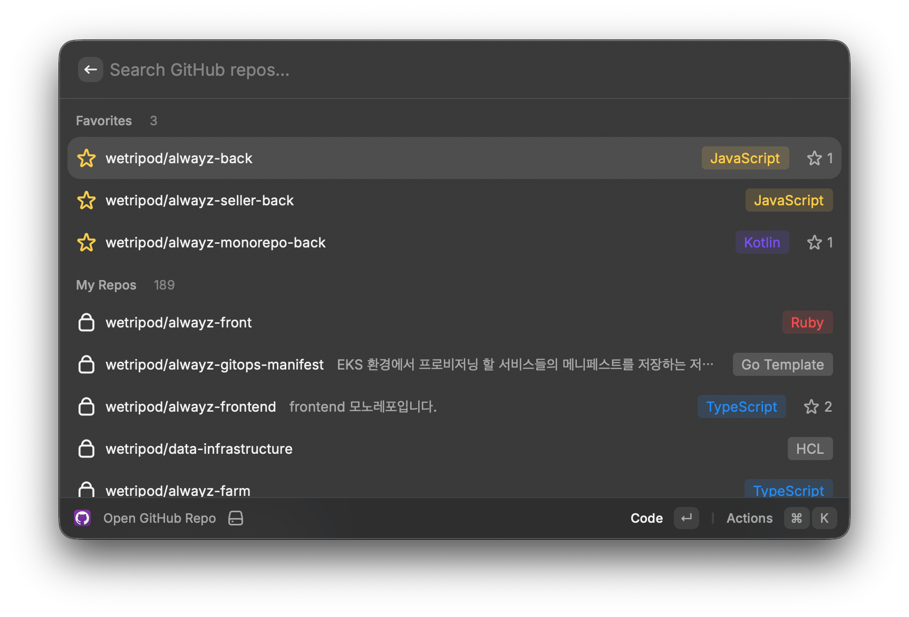
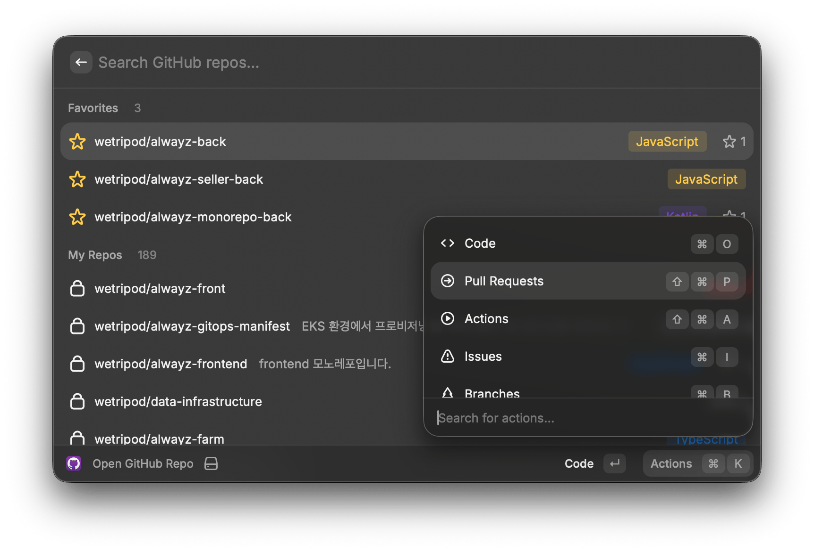

# GitHub Repo Opener

> [한국어](./README.md)

Search and open GitHub repositories in the browser with sub-page shortcuts.

## Screenshots

| Repo List | Action Panel |
|-----------|--------------|
|  |  |

## Features

- All repos you have access to (owned, collaborator, organization)
- **Favorites** — pin frequently used repos to the top (`Cmd+F`)
- Sections: Favorites > My Repos > Organizations & Contributed
- Language tags with color coding
- Direct shortcuts to Code, PRs, Actions, Issues, Branches, Releases, Settings
- 30-day cache with manual refresh (`Cmd+R`)

## Setup

### 1. Get GitHub Token

```bash
# If you have gh CLI installed:
gh auth token
```

Or create a Personal Access Token at **GitHub Settings > Developer settings > Personal access tokens**.

### 2. Install Extension

```bash
cd github-repo-opener
npm install
npm run dev
```

### 3. Configure Token

On first launch, Raycast will prompt for the GitHub token. Paste your `ghp_...` or `gho_...` token.

## Keyboard Shortcuts

| Shortcut | Action |
|----------|--------|
| `Enter` | Open repo (Code) |
| `Cmd+O` | Open repo (Code) |
| `Cmd+Shift+P` | Pull Requests |
| `Cmd+Shift+A` | Actions |
| `Cmd+I` | Issues |
| `Cmd+B` | Branches |
| `Cmd+L` | Releases |
| `Cmd+Shift+,` | Settings |
| `Cmd+F` | Toggle favorite |
| `Cmd+R` | Refresh repo list |
