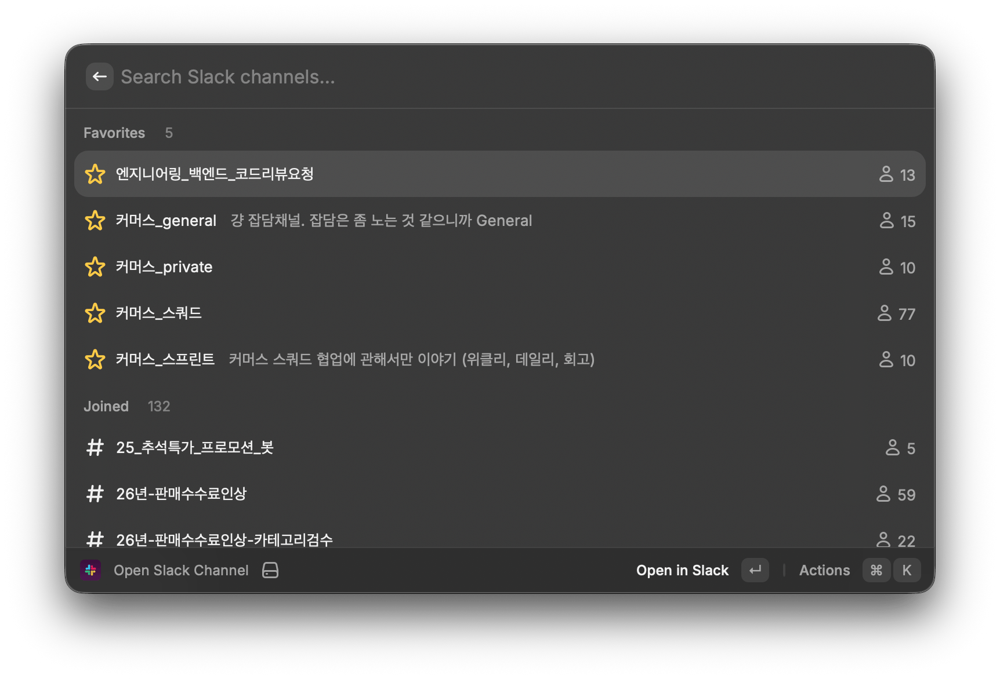
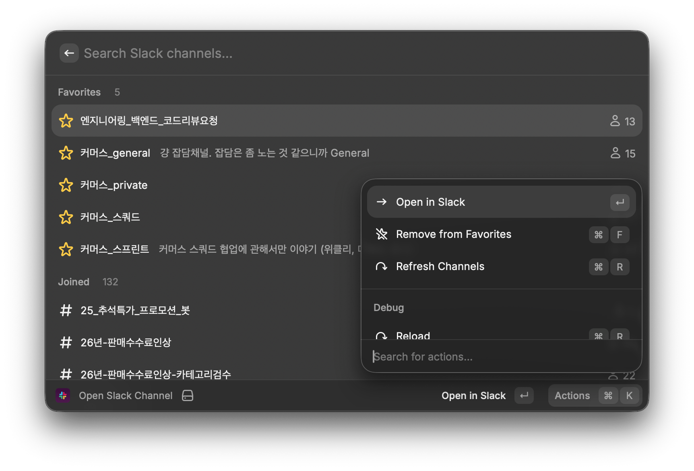

# Slack Channel Opener

> [English](./README_EN.md)

Raycast에서 Slack 채널을 검색하고 바로 여는 확장입니다.

## 스크린샷

| 채널 목록 | 액션 패널 |
|-----------|-----------|
|  |  |

## 기능

- 워크스페이스 전체 채널 퍼지 검색
- **즐겨찾기** — 자주 쓰는 채널을 상단에 고정 (`Cmd+F`)
- 섹션 구분: Favorites > Joined > Other
- 비공개 채널은 잠금 아이콘으로 표시
- 30일 캐시 + 수동 새로고침 (`Cmd+R`)

## 설치

### 1. Slack App 생성

1. https://api.slack.com/apps > **Create New App** > From scratch
2. 워크스페이스 선택
3. **OAuth & Permissions** > **User Token Scopes**에 추가:
   - `channels:read` (공개 채널)
   - `groups:read` (비공개 채널)
4. **Install to Workspace** > **Allow**
5. **User OAuth Token** (`xoxp-...`) 복사

> **주의**: Bot Token Scopes가 아닌 **User Token Scopes**에 추가해야 합니다.

### 2. 확장 설치

```bash
cd slack-channel-opener
npm install
npm run dev
```

### 3. 토큰 설정

첫 실행 시 Raycast가 토큰 입력을 요청합니다. `xoxp-...` 토큰을 붙여넣으세요.

## 단축키

| 단축키 | 동작 |
|--------|------|
| `Enter` | Slack에서 채널 열기 |
| `Cmd+F` | 즐겨찾기 토글 |
| `Cmd+R` | 채널 목록 새로고침 |
