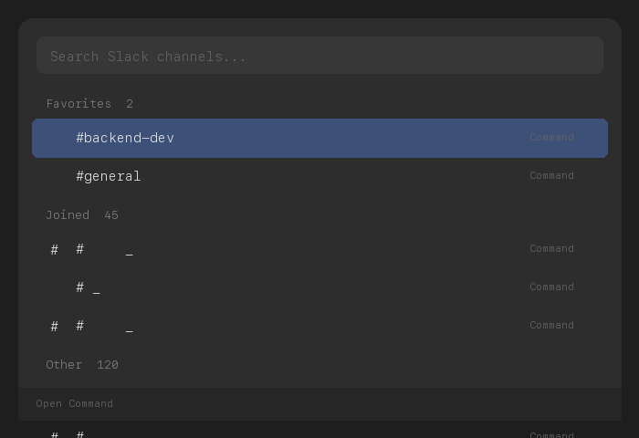

# Slack Channel Opener

Search and open Slack channels directly from Raycast.



## Features

- Fuzzy search across all workspace channels
- **Favorites** — pin frequently used channels to the top (`Cmd+F`)
- Sections: Favorites > Joined > Other
- Private channels shown with lock icon
- 30-day cache with manual refresh (`Cmd+R`)

## Setup

### 1. Create Slack App

1. Go to https://api.slack.com/apps > **Create New App** > From scratch
2. Select your workspace
3. **OAuth & Permissions** > **User Token Scopes** > Add:
   - `channels:read` (public channels)
   - `groups:read` (private channels)
4. **Install to Workspace** > **Allow**
5. Copy the **User OAuth Token** (`xoxp-...`)

> **Note**: Use **User Token Scopes**, not Bot Token Scopes. Bot tokens only see channels the bot has joined.

### 2. Install Extension

```bash
cd slack-channel-opener
npm install
npm run dev
```

### 3. Configure Token

On first launch, Raycast will prompt for the Slack User Token. Paste the `xoxp-...` token.

## Keyboard Shortcuts

| Shortcut | Action |
|----------|--------|
| `Enter` | Open channel in Slack |
| `Cmd+F` | Toggle favorite |
| `Cmd+R` | Refresh channel list |
